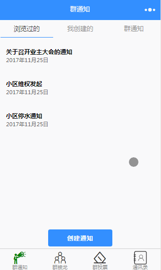
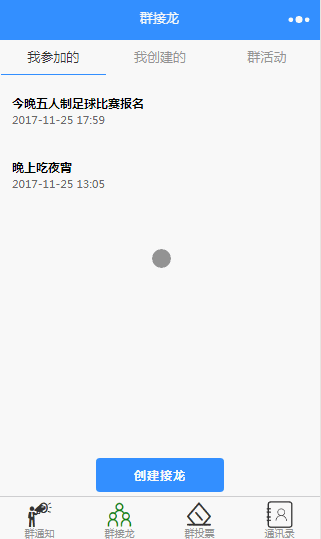
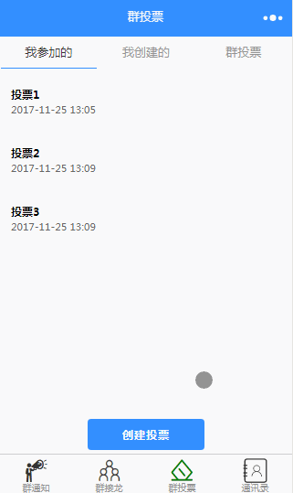
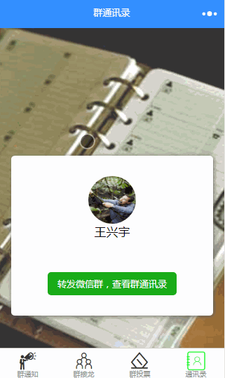
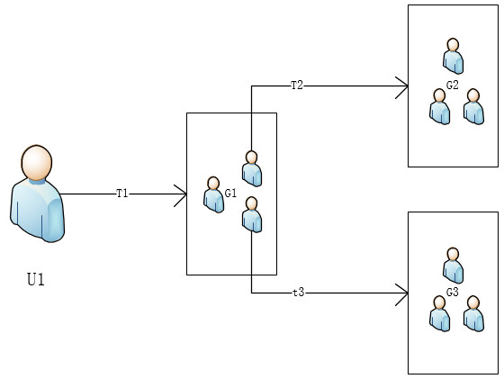

# wechat-weapp-GroupUtils
一款微信小程序群应用，包括群通知、群接龙、群投票、群通讯录4大功能

## 项目背景：
为了增加用户使用量和粘度，我们考虑在小程序中增加更多的‘群’元素。制作此小程序一来看看用户使用效果，二来熟悉小程序的群功能。

## 软件截图：
    
  

## 目录结构说明：
```
├─client # 小程序端代码
│   ├─imgs # 图片存放处
│   ├─pages # 各个页面代码的存放处
│   │   ├─link # 群接龙模块
│   │   ├─notice # 群通知模块
│   │   │─phoneBook # 群通讯录模块
│   │   └─vote # 群投票模块
│   │─utils # 工具包
│   │   ├─page.js # 用户信息追溯模块——分享页面配置的模板
│   │   ├─shareModule.js # 用户信息追溯模块——存储用户信息模块
│   │   └─util.js # 格式化工具
│   ├─app.js # 全局JS
│   ├─app.json # 全局配置
│   ├─app.wxss # 全局样式
├─server # 服务器端代码
│   └─application # 业务代码存放处
│         ├─link # 群接龙模块存放处
│         ├─notice # 群通知模块存放处
│         ├─phoneBook # 群通讯录模块存放处
│         ├─vote # 群投票模块存放处
│         └─groupUtils.sql # mysql数据库结构
└─project.config.json # 项目配置      

```

## 特点：
* 包含小程序+php+msyql全套代码
* 包含了很多小程序刚开放不久的新功能
* 包含了用户追溯系统： 小程序shareTicket转发和打开时能获取微信群的ID，我们可以将小程序转发路径当成转发链，进而拓展为转发树，如此我们能处理发现群组与群组，群组与成员之间关系。



## 本地安装步骤：
```
1、克隆项目到本地：git clone git@github.com:wechat-wxapp/wechat-weapp-GroupUtils.git 
2、打开微信小程序开发工具，导入整个项目文件。因为是本地项目，记得打开“不校验安全域名、TLS 版本以及 HTTPS 证书”
3、查看本机ip地址，例如：192.168.0.101，并将client/app.js中const host = 'http://192.168.x.xxx' 改为你的ip地址
4、启动本地的apache和mysql服务器，我用的是XAMPP软件
5、在server\application中找到groupUtils.sql，并导入数据库
6、将整个application文件夹复制到服务器中，我的地址是C:\xampp\htdocs

```


### 项目用于学习交流, 转载请注明出处


